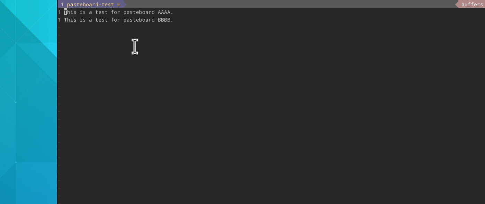

# my-gnome-extensions-list

## Clipboard indicator

**Link:**  
https://extensions.gnome.org/extension/779/clipboard-indicator/

## Bluetooth Quick Connect

**Link:**  
https://extensions.gnome.org/extension/1401/bluetooth-quick-connect/

## Drop down terminal

**Link:**  
https://extensions.gnome.org/extension/3780/ddterm/

## Soud output device chooser

**Link:**  
https://extensions.gnome.org/extension/906/sound-output-device-chooser/

## Easy screen cast

**Link:**  
https://extensions.gnome.org/extension/690/easyscreencast/

## Screenshot tool

**Link:**  
https://extensions.gnome.org/extension/1112/screenshot-tool/

## Refresh WiFi connections

**Link:**  
https://extensions.gnome.org/extension/905/refresh-wifi-connections/

## Net speed indicator

**Link:**  
https://extensions.gnome.org/extension/104/netspeed/

## Speed up gnome shell's animation

**Link:**  
https://extensions.gnome.org/extension/277/impatience/
